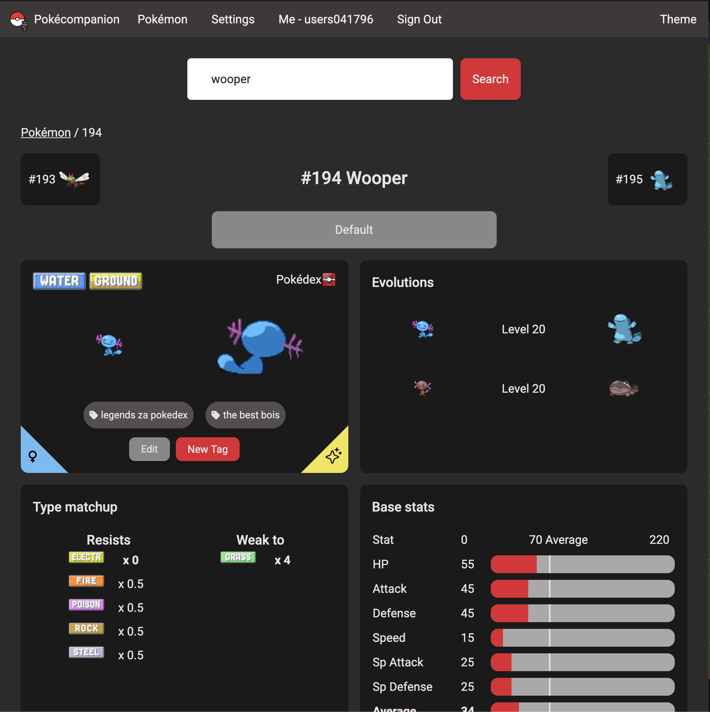

# Pokécompanion

<a href="https://pokecompanion.com">
  
</a>
<h4>Your companion through the world of Pokemon</h4>
<a href="https://github.com/helblinglilly/pokecompanion/commits/main"></a>
<a href="https://github.com/helblinglilly/pokecompanion/commits/main"></a>
<div/>
<a href="https://pokecompanion.com">www.pokecompanion.com</a>

<br />

<br />



## Getting started

```sh
cp .env.example .env
# Change any values as required

npm i
npm run schema
npm run dev
```

## A new ??? has released! Where is it?

We scrape Pokeapi on a weekly basis, which should surface any new data in search.

Otherwise, trying to access that Pokemon/Item/Ability/Move should be able to surface any Pokeapi data - if it exists.
