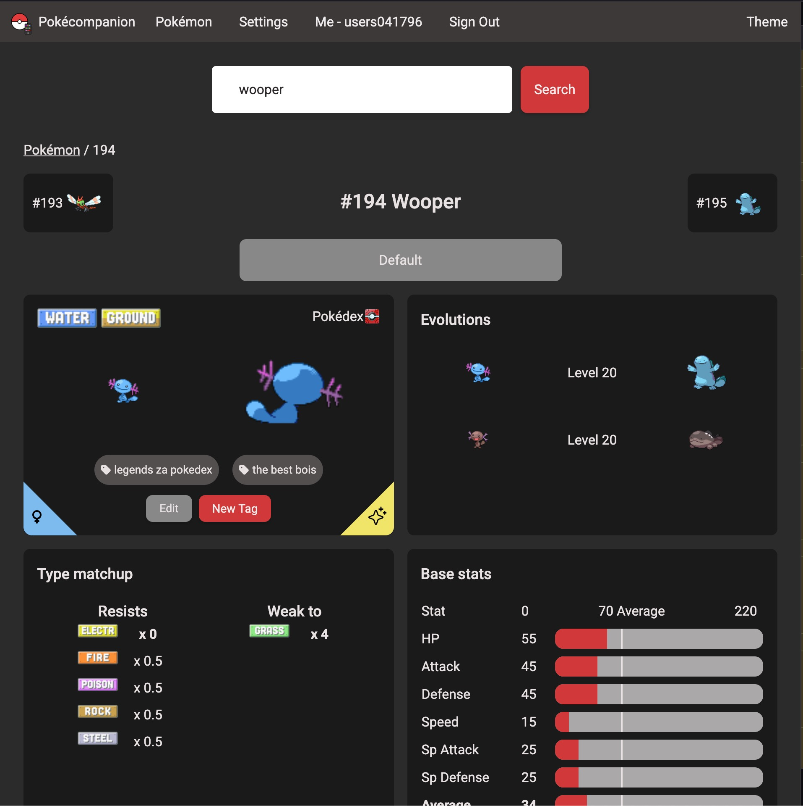

# Pokécompanion

<a href="https://pokecompanion.com">
  
</a>
<h4>Your companion through the world of Pokemon</h4>
<a href="https://github.com/helblinglilly/pokecompanion/commits/main"></a>
<a href="https://github.com/helblinglilly/pokecompanion/commits/main"></a>
<div/>
<a href="https://pokecompanion.com">www.pokecompanion.com</a>

<br />

<br />



## Getting started

```sh
cp .env.example .env
# Change any values as required

npm i
npm run schema
npm run dev
```

## Deploying to Cloudflare Pages

This project is deployed with a direct Wrangler upload, not Cloudflare Pages Git integration. `wrangler.jsonc` owns the Pages project name, build output directory, compatibility date, and compatibility flags. The SvelteKit Cloudflare adapter writes the deployable Worker and static assets to `.svelte-kit/cloudflare`.

```sh
# Authenticate once when developing locally
npx wrangler login

# Deploy the `develop` preview branch
npm run deploy:preview

# Deploy the `main` production branch
npm run deploy:production
```

The existing Pages project must be named `pokecompanion`, with `main` configured as its production branch. The compatibility date and `nodejs_compat` flag are declared in `wrangler.jsonc`.

Pushes to `main` run `.github/workflows/deploy-pages.yml`, which builds the application and uploads `.svelte-kit/cloudflare` with Wrangler. Configure the following secrets in the GitHub `production` environment: `CLOUDFLARE_API_TOKEN`, `CLOUDFLARE_ACCOUNT_ID`, `DISCORD_WEBHOOK_URL`, `PUBLIC_API_HOST`, and `PUBLIC_POSTHOG_KEY`. The workflow writes `DISCORD_WEBHOOK_URL` to the Pages project with `wrangler pages secret put` before deploying; it is never committed. The `PUBLIC_*` values are intentionally compiled into the public bundle.

> The previous infrastructure configuration contained credential values. Rotate those values and remove them from Terraform state/configuration before using this workflow.

## A new ??? has released! Where is it?

We scrape Pokeapi on a weekly basis, which should surface any new data in search.

Otherwise, trying to access that Pokemon/Item/Ability/Move should be able to surface any Pokeapi data - if it exists.
